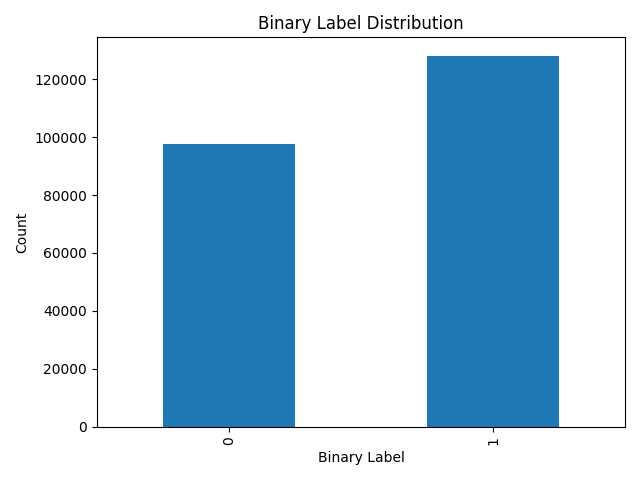
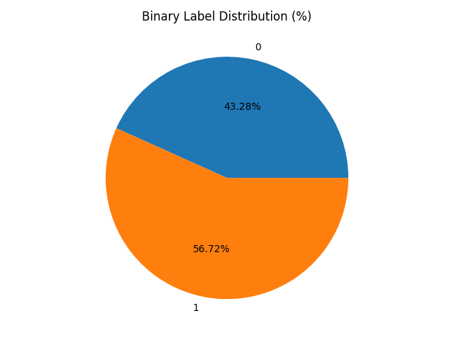
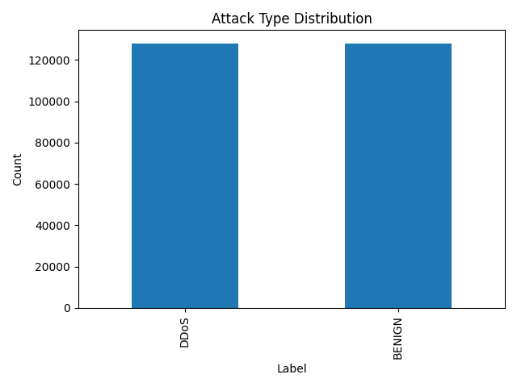
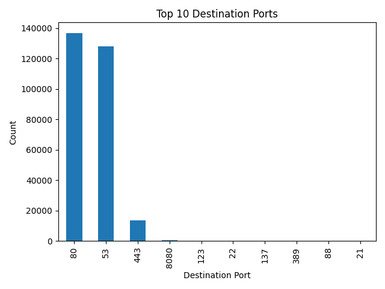

# CIC IDS 2017 Traffic Analysis

## 1. 프로젝트 주제

이 프로젝트는 CIC IDS 2017 네트워크 트래픽 데이터를 사용해서 정상 트래픽과 공격 트래픽의 차이를 간단히 분석하고 시각화하는 프로젝트입니다.

처음에는 하나의 CSV 파일을 기준으로 데이터를 불러오고, 필요한 컬럼만 선택한 뒤 기본 통계와 그래프를 확인합니다.

## 2. 사용 데이터셋

- 데이터셋: CIC IDS 2017
- 원본 CSV 위치: `data/raw/MachineLearningCVE/`
- 현재 기본 사용 파일:
  - `Friday-WorkingHours-Afternoon-DDos.pcap_ISCX.csv`

## 3. 개발 환경

- WSL2
- Python
- pandas
- matplotlib

## 4. 분석 흐름

분석 코드는 아래 순서로 실행됩니다.

```text
load_data -> preprocess -> analysis -> visualize
```

- `src/load_data.py`: CSV 파일을 읽고 컬럼 공백을 제거한 뒤 필요한 10개 컬럼만 선택합니다.
- `src/preprocess.py`: 라벨을 정리하고, 정상/공격 이진 라벨을 만든 뒤 결측치를 처리합니다.
- `src/analysis.py`: 정상/공격 개수, 공격 유형 분포, 목적지 포트 상위 10개를 출력합니다.
- `src/visualize.py`: 분석 결과를 bar chart로 시각화하고 이미지로 저장합니다.

## 5. 주요 분석 항목

- 정상 트래픽과 공격 트래픽 개수 비교
- `Label` 기준 공격 유형 분포 확인
- `Destination Port` 기준 상위 10개 포트 확인
- 결과를 bar chart로 시각화

## 6. 실행 방법: 로컬 실행

venv 기준으로 실행합니다.

1. 프로젝트 폴더로 이동합니다.

```bash
cd /home/choijiwng/projects/cic-ids2017-visualization
```

2. 패키지를 설치합니다.

```bash
.venv/bin/pip install -r requirements.txt
```

3. 데이터 로드를 확인합니다.

```bash
.venv/bin/python src/load_data.py
```

4. 전처리를 확인합니다.

```bash
.venv/bin/python src/preprocess.py
```

5. 분석 결과를 출력합니다.

```bash
.venv/bin/python src/analysis.py
```

6. 그래프를 생성하고 저장합니다.

```bash
.venv/bin/python src/visualize.py
```

## 7. 실행 방법: Docker 실행

Docker가 설치되어 있으면 아래 순서로 실행할 수 있습니다.

1. 프로젝트 폴더로 이동합니다.

```bash
cd /home/choijiwng/projects/cic-ids2017-visualization
```

2. Docker 이미지를 빌드합니다.

```bash
docker build -t cic-ids2017-visualization .
```

3. 컨테이너를 실행합니다.

```bash
docker run --rm cic-ids2017-visualization
```

Docker 실행 시 기본으로 `src/visualize.py`가 실행됩니다.

## 8. 결과 이미지 위치

시각화 결과 이미지는 아래 폴더에 저장됩니다.

```text
reports/figures/
```

저장되는 파일:

- `binary_label_distribution.png`
- `attack_type_distribution.png`
- `port_top10.png`

## 9. 분석 결과

### 1. 정상 vs 공격 비율
- 공격 트래픽이 정상보다 높은 비율을 차지 (약 56%)
- DDoS 공격 특성상 대량의 트래픽이 발생하기 때문

### 2. 공격 유형 분포
- DDoS 공격이 대부분을 차지
- 일부 공격 유형은 데이터 수가 매우 적어 데이터 불균형 존재

### 3. 포트 분포
- 80, 53, 443 포트에 트래픽 집중
- 웹 서비스 및 DNS 기반 공격 패턴 확인 가능

### 4. 해석
- DDoS 공격은 높은 패킷 수와 트래픽 속도를 특징으로 한다
- 특정 포트와 트래픽 패턴을 통해 공격을 구분할 수 있다

---

## 10. 결과 시각화

### Binary Label Distribution


### Binary Label (Pie)


### Attack Type Distribution


### Top 10 Destination Ports


---

## 11. 프로젝트에서 배운 점

- 데이터 분석에서 전처리의 중요성을 이해하게 되었다
- 단순한 시각화가 아니라 데이터의 의미를 해석하는 과정이 중요함을 배웠다
- 네트워크 트래픽 패턴을 통해 공격 특성을 파악할 수 있었다
- Docker를 통해 동일한 환경에서 실행 가능한 프로젝트를 구성할 수 있었다